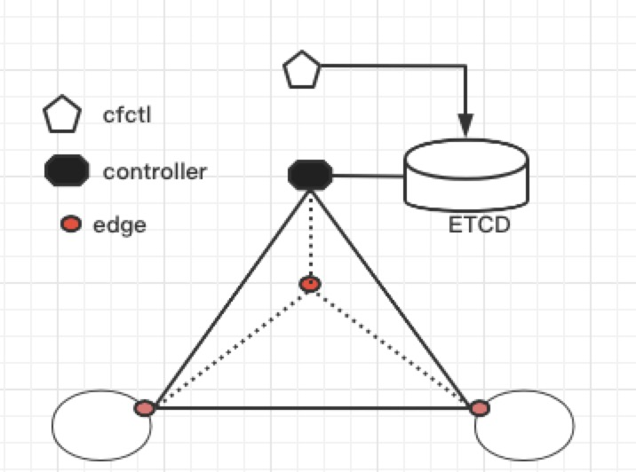

<!-- 

  

 -->

  
  

  
  

[English](README_EN.md) | 简体中文

## 介绍

**状态: Work in progress**

cframe是一款网状VPN项目，能解决多个IP地址不冲突的网络互联，以下是一些典型的应用场景：

- 跨VPC之间网络互联
- 跨云网络互联
- VPC与IDC网络互联
- k8s多集群互联

cframe包括两个重要组件，`controller`和`edge`，controller也即是控制平面，用于路由下发以及edge节点管理，edge也即是数据平面，用于路由和转发数据到对应的edge节点，任意两个edge节点互联，形成一个网状结构。

## 目录
- [介绍](#介绍)
- [功能特性](#功能特性)
- [cframe的技术原理](#cframe的技术原理)
- [如何开始使用](#如何开始使用)
- [有问题怎么办](#有问题怎么办)
- [关于作者](#关于作者)

## 功能特性

## cframe的技术原理
[返回目录](#目录)

## 如何使用
[返回目录](#目录)

## 有问题怎么办
[返回目录](#目录)

## 关于作者
一个爱好编程的人，网名叫ICKelin。对于以下任何问题，包括

- 项目实现细节
- 项目使用问题
- 项目建议，代码问题
- 案例分享
- 技术交流

可加微信: zyj995139094