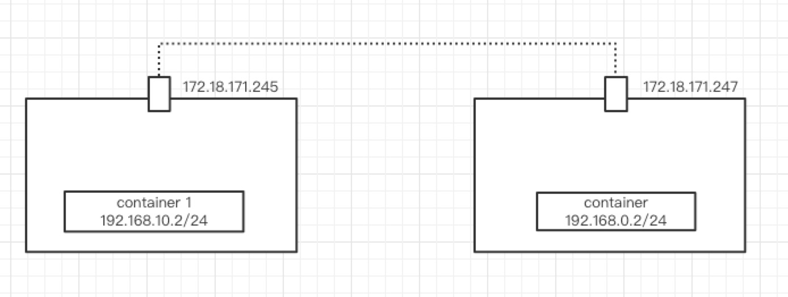
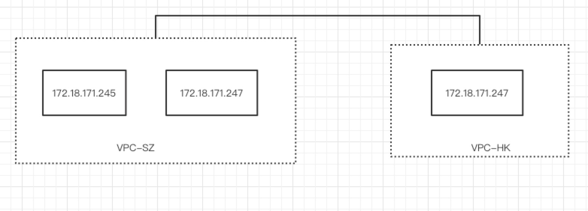

## cframe
cframe是一个网络互联项目，主要解决：

- 容器互联
- 跨VPC互联
- 跨云互联
- 云与IDC互联

## v1.1.x
v1.1.x在v1.0.0的基础上，支持跨主机容器互联，VPC之间互联，跨云互联等，理论上支持云与IDC互联（未测试）。

**v1.1.x版本需要网络管理员自行解决地址冲突与地址划分**

## 场景实例
此处提供三种互联应用场景实例。

### 容器间互联
第一个场景，解决以下拓扑当中container 1和container 2能够通过容器ip进行通信，最终的目的是在左侧容器当中，ping 192.168.0.2能够收到回包，在右侧容器ping 192.168.10.2也能够收到回包。



左侧配置:

```
controller="172.18.171.245:8384"

[local]
listen_addr="172.18.171.245:58423"
addr="172.18.171.245:58423"
cidr="192.168.10.0/24"

```

- controller指定控制器地址
- local.listen_addr指定本地内网监听地址，
- local.addr指定本地外网监听地址，该地址是其他节点与其通信的基础
- cidr指定本地容器网段

同一VPC当中local.listen_addr应该等于local.addr

右侧配置:

```
controller="172.18.171.245:8384"

[local]
listen_addr="172.18.171.247:58422"
addr="172.18.171.247:58422"
cidr="192.168.0.0/24"

```

参数意义与上述相同，通过以上配置之后，两边容器网络即可互通。

### 跨VPC，跨云互联
第二个场景，解决跨VPC云服务器之间互联，具体拓扑如下，这一场景主要解决两边VPC互联问题，在两边均可通过对端vpc访问。



左侧配置如下:

```
controller="controller_public_ip:8384"

[local]
listen_addr="172.18.171.245:58423"
addr="public_ip:58423"
cidr="172.18.0.0/16"
```

右侧配置如下:

```
controller="controller_public_ip:8384"

[local]
listen_addr=":58422"
addr="public_ip58422"
cidr="172.31.0.0/16"
#cidr="192.168.150.0/24"
```

需要注意，左侧和右侧的cframe进程需要运行在网关，否则只能完成两个云服务器进行通信。

## 最后
如果您有更好的idea，或者需要解决的问题，欢迎提issue和pull request。
